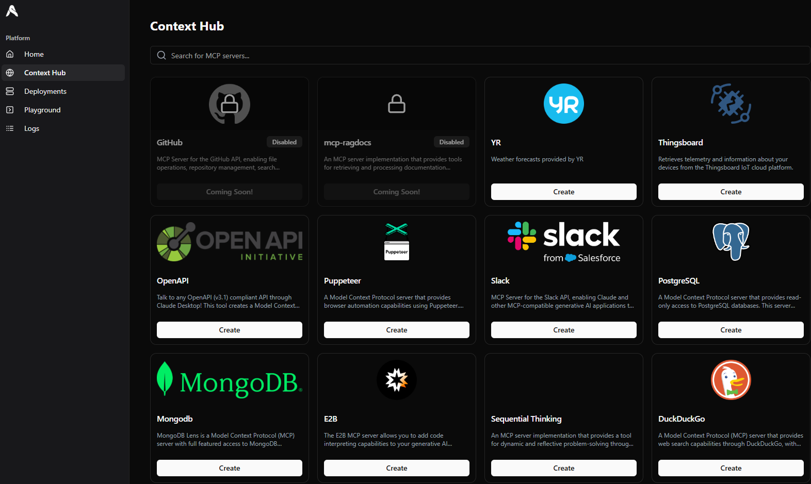
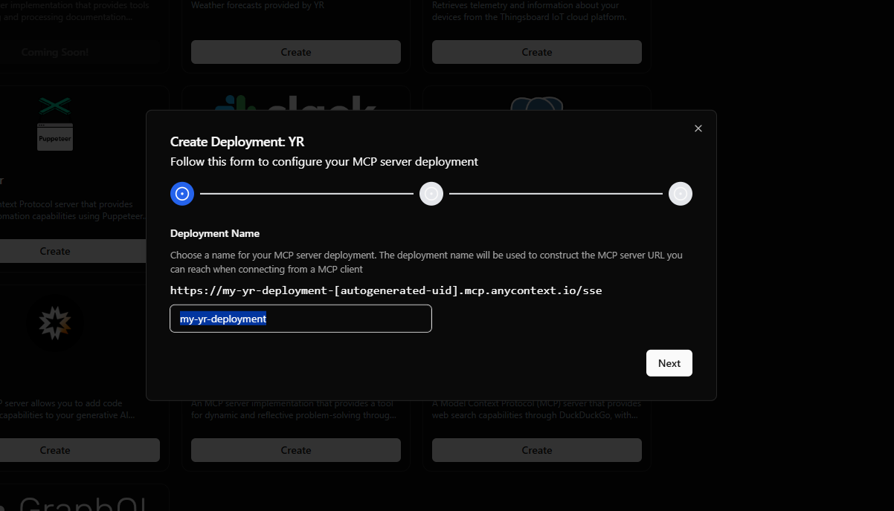
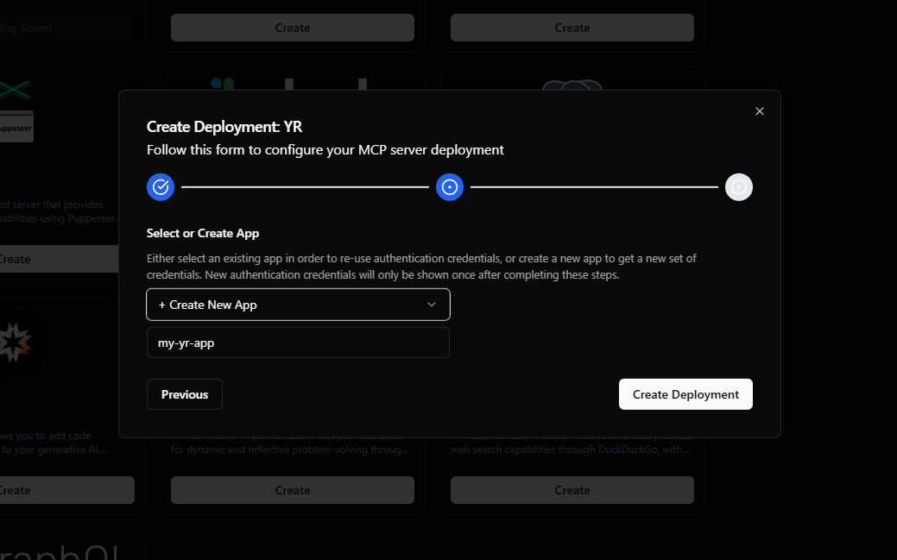
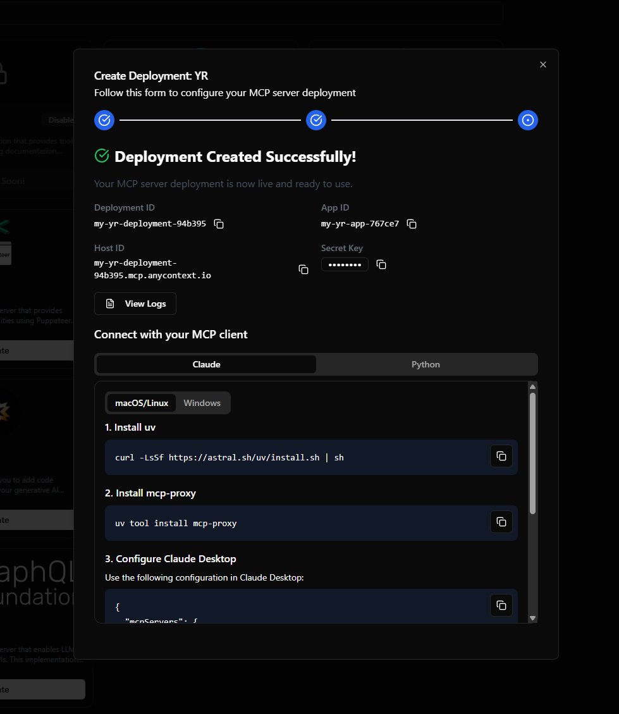
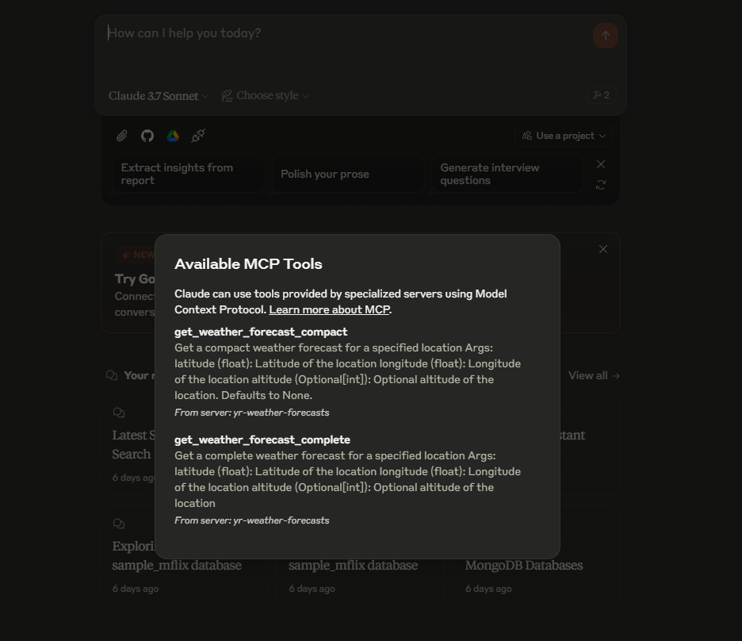
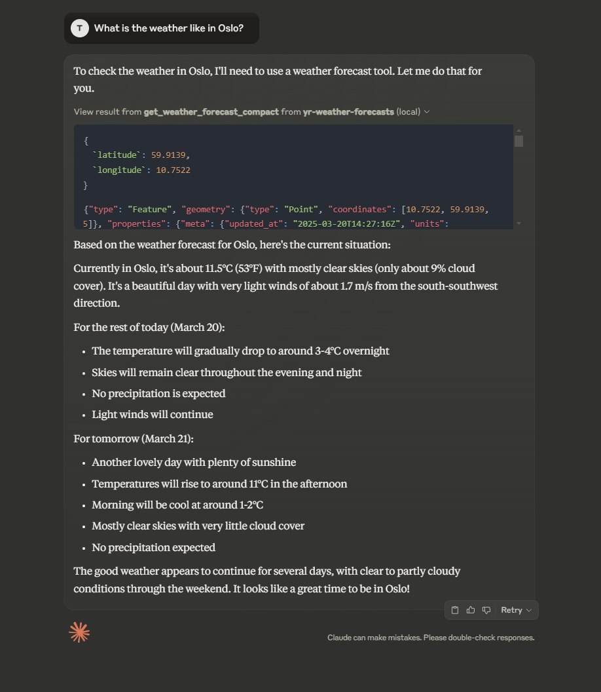

# Deploy your first MCP server

This guide will show you how to deploy the YR MCP server on AnyContext which will enable Claude (or other generative AI applications) to access weather forecasts.
Sign in or create an account at [app.anycontext.io](app.anycontext.io).

## Deploy the YR Weather Forecasts MCP Server

1. Navigate to the [Context Hub](app.anycontext.io/context-hub). Here you can find all the available MCP servers you can deploy.

    

2. Click the "Create"-button for the YR MCP server.

3. Choose a name for your MCP server deployment. The deployment name will be used to construct the MCP server URL you can reach when connecting from a MCP client. Then click "Next". 

    

4. Enter a name for your new app. Either select an existing app in order to re-use authentication credentials, or create a new app to get a new set of credentials. New authentication credentials will only be shown once after completing these steps.  

    

5. Congratulations, you have now deployed your first MCP server! 🚀

    

## Connect to Claude

At the moment Claude does not support SSE transport for MCP server connections. However, we can use mcp-proxy in order to proxy between stdio and SSE.


### Install uv
=== "macOS/Linux"
    ```sh
    curl -LsSf https://astral.sh/uv/install.sh | sh
    ```

=== "Windows"
    ```powershell
    powershell -ExecutionPolicy ByPass -c "irm https://astral.sh/uv/install.ps1 | iex"
    ```

### Install mcp-proxy
```sh
uv tool install mcp-proxy
```

### Configure Claude Desktop
Open Claude Desktop, and navigate to the developer settings. Paste the following configuration into the `claude_desktop_config.json` file:
```json
{
    "mcpServers": {
        "yr-weather-forecasts": {
        "command": "mcp-proxy",
        "args": [
            "https://<your-deployment-id>.mcp.anycontext.io/sse",
            "--headers",
            "x-api-key",
            "<your-secret-key>"
        ]
        }
    }
}
```
Restart Claude Desktop, and ask about the weather!






