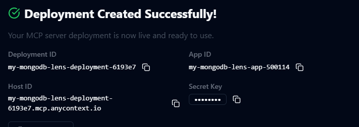
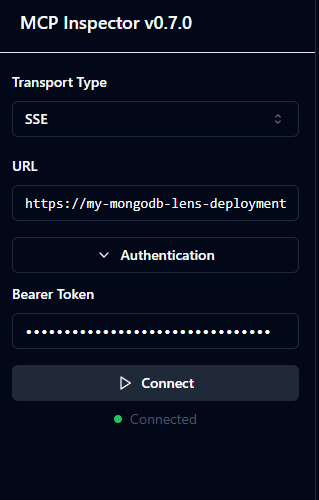
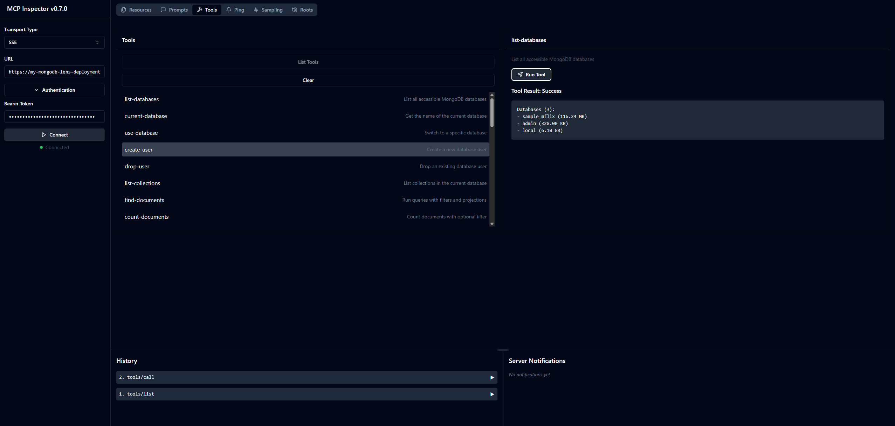

# Debugging with MCP Inspector

[MCP Inspector](https://github.com/modelcontextprotocol/inspector) is an open-source tool for testing and debugging MCP servers. This tutorial will show you how to install MCP inspector and connect to an MCP server hosted on AnyContext.

## Installing MCP Inspector

1. The recommended way to install MCP inspector is using npm. If you havent already got node and npm installed, you can follow the guide from [here](https://docs.npmjs.com/downloading-and-installing-node-js-and-npm).
2. Open a terminal, and run the command: `npx @modelcontextprotocol/inspector`. On success, you will see an output like this:
    ```
    Starting MCP inspector...
    Proxy server listening on port 3000

    🔍 MCP Inspector is up and running at http://localhost:5173 🚀
    ```

## Inspecting an MCP server
1. Find the secret key belonging to the app you created in AnyContext with the MCP server deployment you wish to inspect. Also take note of the MCP server URL.
    
    

2. Open a browser and navigate to `http://localhost:5173`
3. Choose SSE transport, and fill in the URL and secret key (bearer token) in the connection settings.

    

4. After clicking connect, you can now navigate through all tools, resources, etc. that the the MCP server exposes.

    
