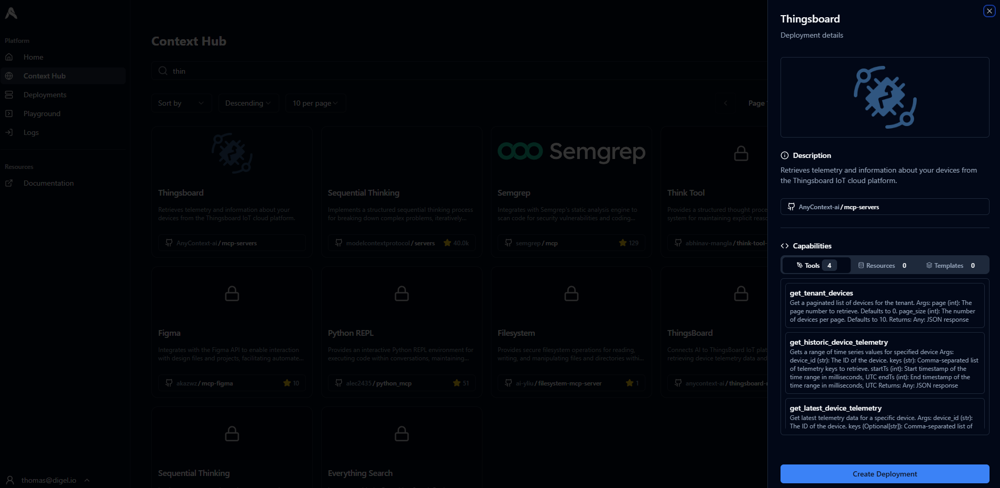
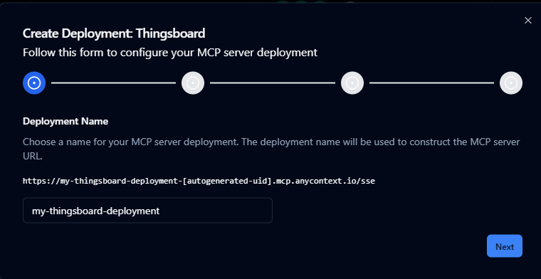
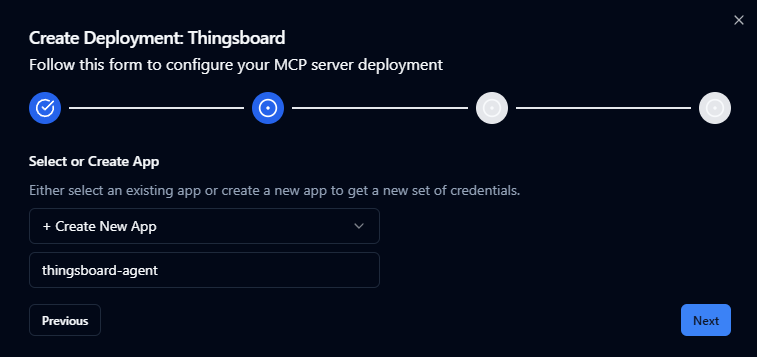
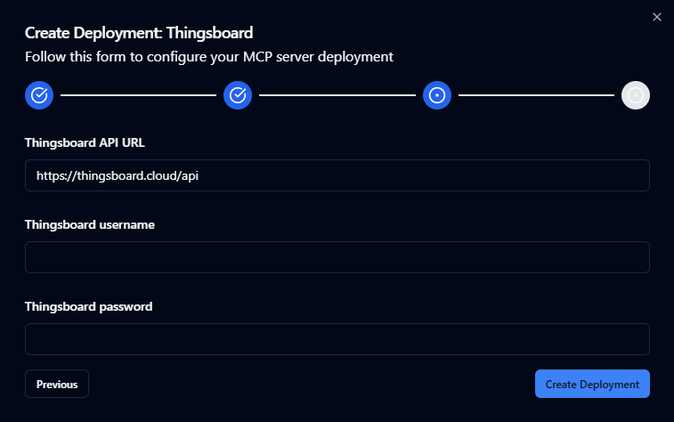
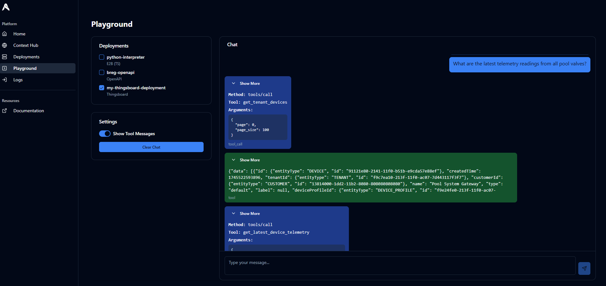
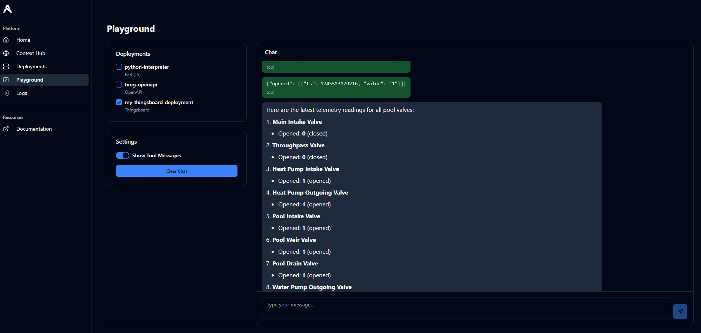
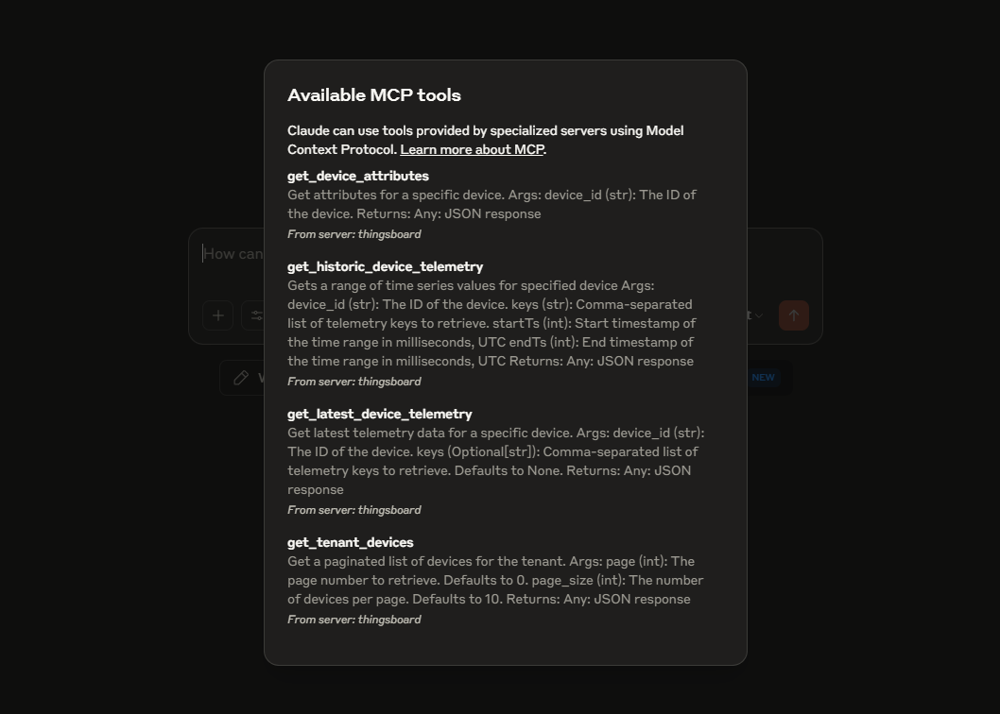
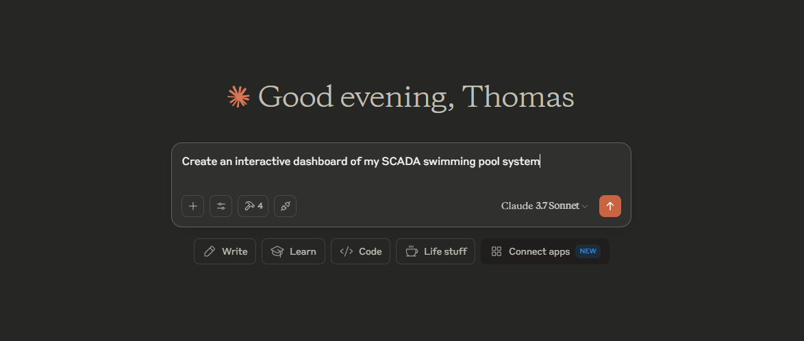
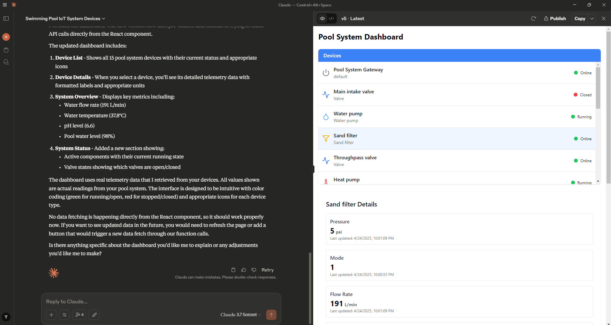

# Thingsboard Agent Tutorial

This guide will show you how to create an agent that is capable of analyzing telemetry data from the [Thingsboard IoT platform](https://thingsboard.io/).
We will be using AnyContext to host our MCP servers and Thingsboard Cloud for storing telemetry.

## Prerequisites

Before we get started, make sure you have the following:

1. **An AnyContext Account**: [Sign up or log in here](https://anycontext.io).
2. **A Thingsboard Cloud Account**: [Create an account here](https://thingsboard.cloud/signup).


## Deploy MCP server

For our Thingsboard Agent we will be needing the **Thingsboard MCP Server**

### Thingsboard MCP Server Deployment
1. **Go to the [Context Hub](https://app.anycontext.io/context-hub)**. Search for *Thingsboard* and click **Create**.

2. Complete the Deployment Wizard.
    - **Give your deployment a name** (e.g. *my-thingsboard-deployment*).
    
    - **Create a new app** (e.g. *thingsboard-agent*).
    
    - **Fill in the URL for the Thingsboard API, email and password**. 
    
        For Thingsboard Cloud, the API URL is https://thingsboard.cloud/api. Use your Thingsboard Cloud credentials.
    
3. **Finish and Save Your Secret Key.** 

    Your Thingsboard MCP server deployment is ready! **Important:** Copy the secret key for the app you created - you will need it soon.

## Try out the Playground Agent
Now let's quickly test out our Thingsboard Agent by navigating to the [Playground](https://app.anycontext.io/playground). Select the Thingsboard MCP server you deployed earlier, and start chatting!




## *Bonus*: Use Claude Desktop as an Agent

With your Thingsboard MCP server live, you can now build powerful dashboards, analyze device data, and automate insights—all from chatting with Claude!

### Configure Claude Desktop
At the moment Claude does not support SSE transport for MCP server connections. However, we can use mcp-proxy in order to proxy between stdio and SSE.

#### Install uv
=== "macOS/Linux"
    ```sh
    curl -LsSf https://astral.sh/uv/install.sh | sh
    ```

=== "Windows"
    ```powershell
    powershell -ExecutionPolicy ByPass -c "irm https://astral.sh/uv/install.ps1 | iex"
    ```

#### Install mcp-proxy
```sh
uv tool install mcp-proxy
```
### Connect Thingsboard MCP Server to Claude Desktop

1. Open Claude Desktop and go to the developer settings.
2. Paste the following configuration (update the placeholders):
```json
{
  "mcpServers": {
    "thingsboard": {
      "command": "mcp-proxy",
      "args": [
        "https://<your thingsboar mcp server deployment id>.mcp.anycontext.io/sse",
        "--headers",
        "x-api-key",
        "<your secret key>"
      ]
    }
  }
}
```
*Tip*: You can find a template for this configuration file by navigating to your Thingsboard MCP server's deployment details on the deployments page at [https://app.anycontext.io/deployments](https://app.anycontext.io/deployments)

After restarting Claude Desktop you should see that Claude Desktop is able to connect to the Thingsboard MCP server hosted on AnyContext.


Using the Thingsboard MCP server we can make Claude generate interactive dashboards that include real telemetry data from Thingsboard Cloud. 

  
