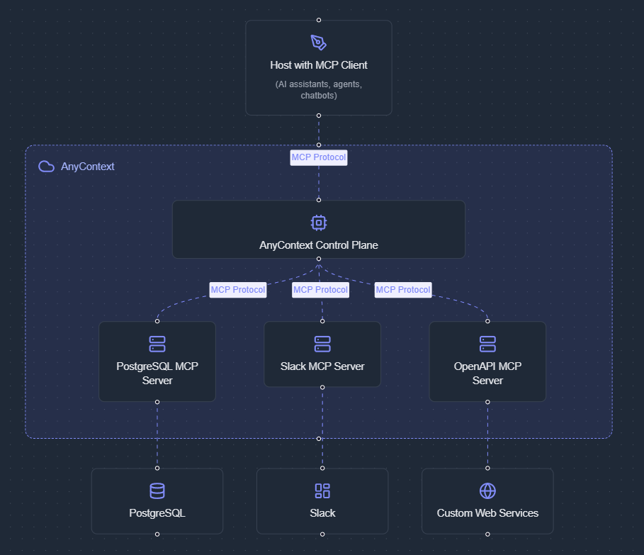

# How it works

AnyContext is a cloud-based hosting platform for Model Context Protocol (MCP) servers, enabling seamless integration between generative AI agents and external systems. MCP servers act as specialized connectors, providing a standardized interface that allows AI agents to interact with various services and data sources. With AnyContext, you can easily deploy MCP servers to the cloud, enabling your AI agents to leverage their capabilities effortlessly in a plug-and-play manner.

## Architecture

AnyContext hosts multiple MCP servers that connect to various external systems, and LLM applications act as MCP clients that communicate with those servers over the network. The MCP servers translate the LLM’s requests into API calls or database queries to fetch or update data, then send the results back so the LLM can incorporate that information into its responses. This architecture decouples the AI from any specific backend, making it easy to plug in new integrations or switch out tools without changing the core application logic.

## Model Context Protocol

At the heart of AnyContext is the Model Context Protocol (MCP), which is the technical standard that makes seamless integration possible. MCP is an open protocol (created by Anthropic) that defines how LLM-driven applications can communicate with external systems and software packages in a structured, secure manner​. It is often described as the “universal adapter” for connecting AI to external data sources and services​.
Instead of writing custom code for every integration you want an AI to use, MCP provides a common language for any tool. This greatly simplifies development: a developer can use the same client implementation talk to many different servers (Slack, GitHub, databases, etc.), each exposing its capabilities in a standardized way​.